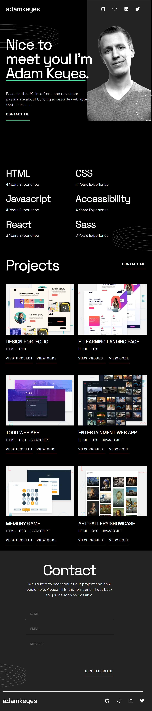
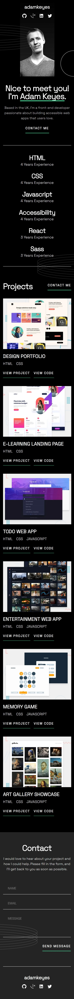

# Single-page developer portfolio

## Table of contents

- [Overview](#overview)
  - [The challenge](#the-challenge)
  - [Screenshot](#screenshot)
- [My process](#my-process)
  - [Built with](#built-with)
  - [What I learned](#what-i-learned)
  - [Useful resources](#useful-resources)
- [Author](#author)

## Overview

### The challenge

Users should be able to:

- Receive an error message when the `form` is submitted if:
  - Any field is empty
  - The email address is not formatted correctly
- View the optimal layout for the interface depending on their device's screen size
- See hover and focus states for all interactive elements on the page
- **Bonus**: Hook the form up so it sends and stores the user's enquiry (you can use a spreadsheet or Airtable to save the enquiries)
- **Bonus**: Add your own details (image, skills, projects) to replace the ones in the design

### Screenshot

- Desktop View
  

- Tablet View
  

- Mobile View
  

### Links

- Live Site URL: (https://martin-developer-portfolio.vercel.app/)

## My process

### Built with

- [React](https://reactjs.org/) - JS library
- [Styled Components](https://styled-components.com/) - For styles
- CSS Flexbox
- CSS Grid

### What I learned

As part of this project I challenged myself to use Webpack 5 to compile JS modules and learn some of its configuration processes. I learned a lot of the loaders and which ones you need to configure to have the compiler run the different type of files. I also used Typescript instead of Javascript for my components.

```js
const path = require('path');
const Dotenv = require('dotenv-webpack');
const HtmlWebpackPlugin = require('html-webpack-plugin');

module.exports = {
  mode: 'development',
  entry: './src/index.js',
  output: {
    path: path.resolve(__dirname, 'public'),
    filename: 'main.js',
  },

  target: 'web',
  devServer: {
    port: '3000',
    static: ['./public'],
    open: true,
    hot: true,
    liveReload: true,
  },
  resolve: {
    extensions: ['.js', '.jsx', '.ts', '.tsx'],
    modules: [path.resolve(__dirname, '../src'), 'node_modules'],
  },
  module: {
    // Rules to how compiler will run certain files.
    rules: [
      {
        test: /\.[jt]sx?$/,
        exclude: /node_modules/,
        use: 'babel-loader',
      },
      {
        test: /\.(png|jpe?g|gif|svg)$/i, // (1)
        type: 'asset/resource',
      },
      {
        test: /\.(webp)$/,
        exclude: /node_modules/,
        use: [{ loader: 'file-loader' }],
      },
      {
        test: /\.css$/,
        use: ['style-loader', 'css-loader'],
      },
    ],
  },
  plugins: [
    new Dotenv({
      ignoreStub: true,
      path: `./.env`,
      defaults: true,
    }),
  ],
};
```

### Useful resources

- [Webpack](https://webpack.js.org/guides/getting-started/)) - This is the documentation to help me get started on using Webpack 5 on this project.

## Author

- Website - [Martin Olague](https://github.com/molague2021)
